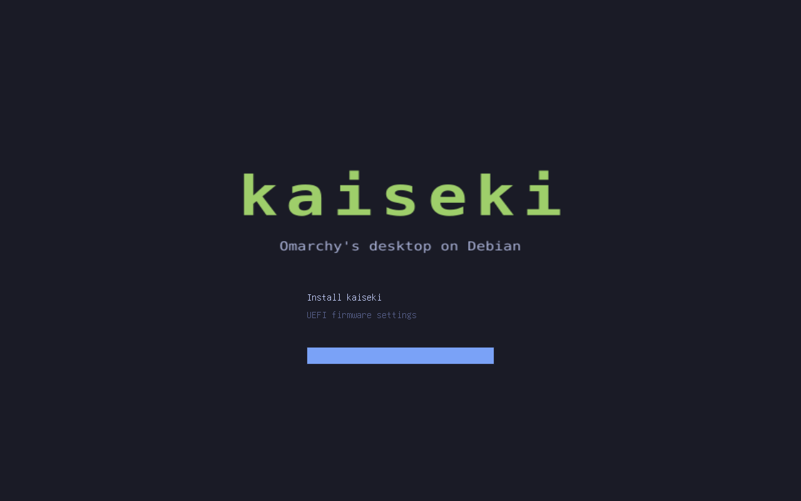
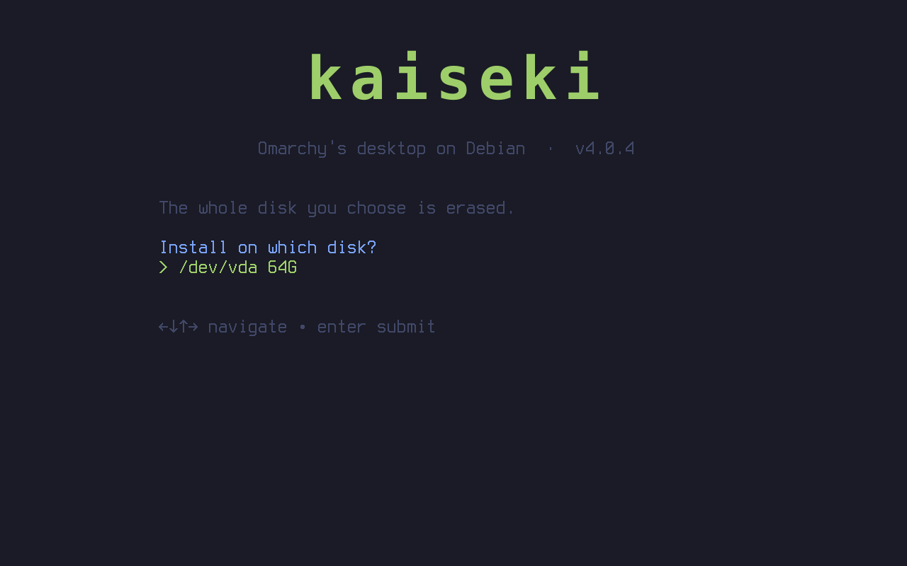
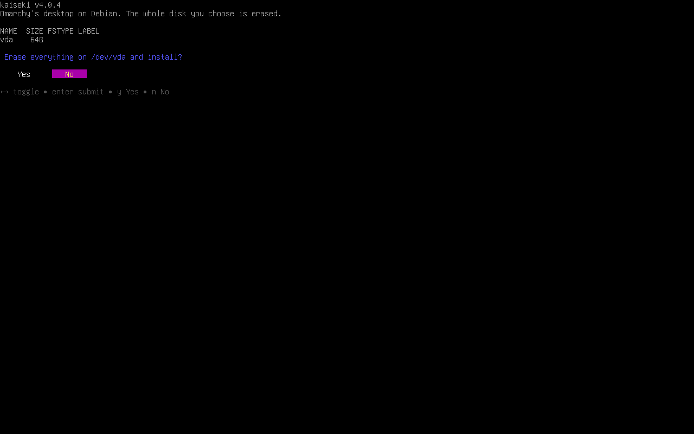
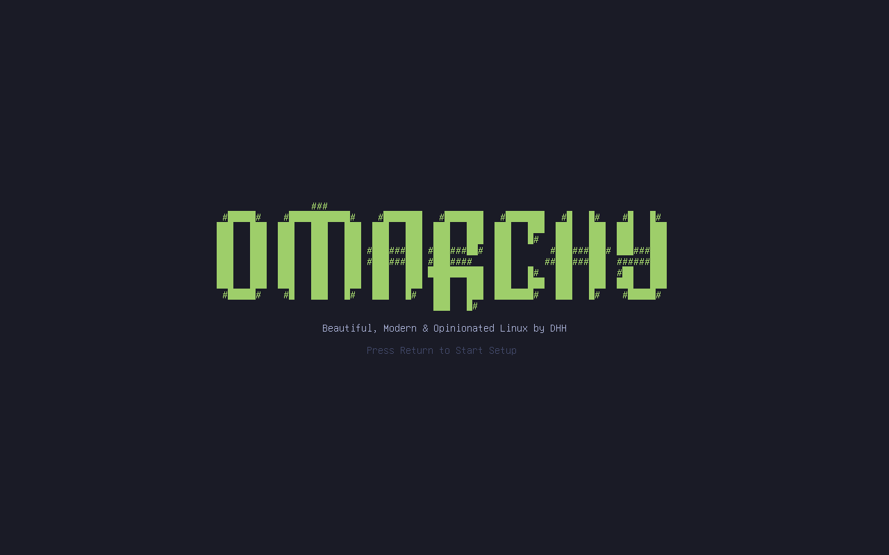
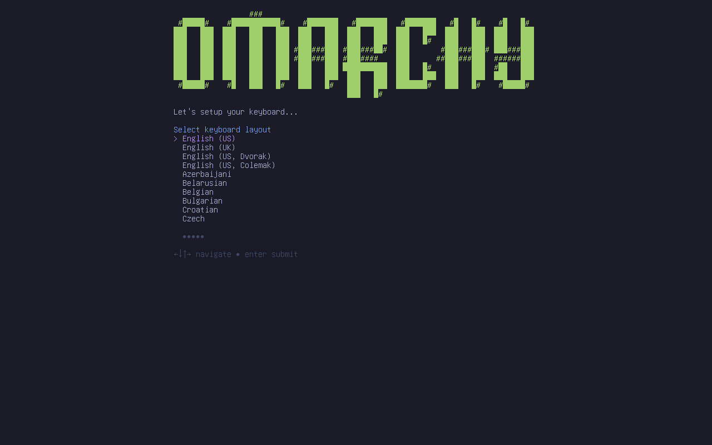
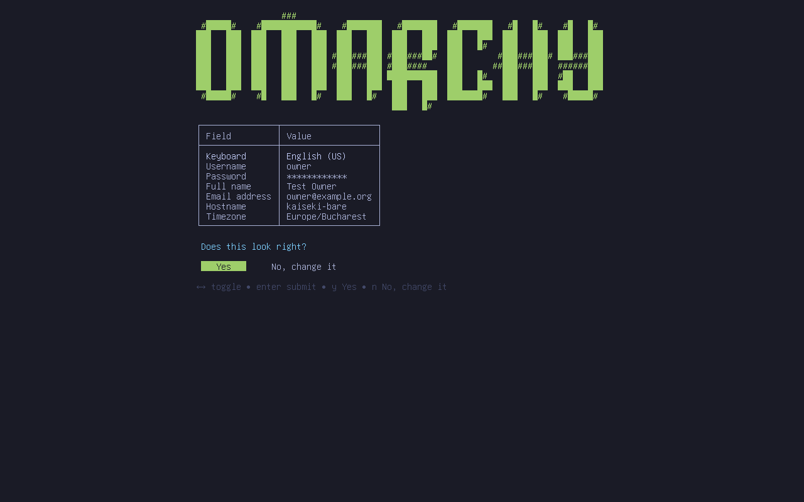
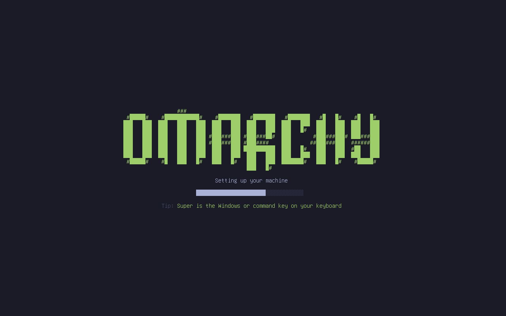
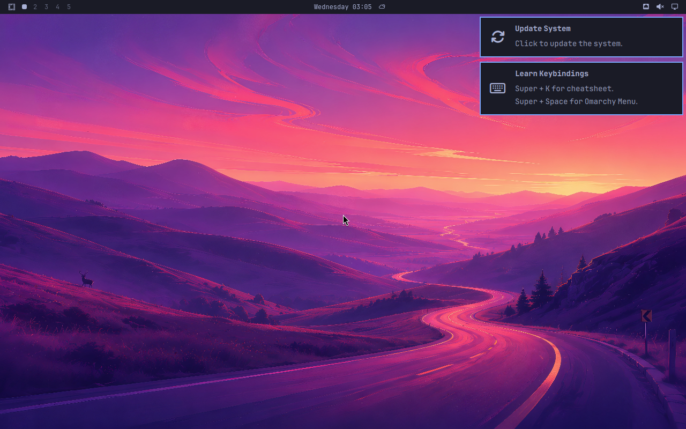

# The kaiseki installer

Boot the ISO, choose the disk, and that is the only decision before the system is running:

1. Boot the ISO.
2. Choose the disk (and confirm that it will be erased).
3. Install, unattended: **57 seconds** in the test VM.
4. The installed system starts **without a reboot**, on the kernel that is already running.
5. Omarchy's own first-boot setup asks for keyboard, account, host name and time zone.
6. It creates the owner, moves the disk encryption to the owner's password, and opens the desktop.

Status (2026-10-06): works end to end in a virtual machine on Debian testing, `tests/run-installer` passes,
including a cold boot from the disk afterwards. Not tried on real hardware.

| | |
|---|---|
| 0. The ISO's boot menu  | |
| 1. Choose the disk  | 2. Confirm  |
| 3. Installed system, same kernel: upstream's setup  | 4. Keyboard  |
| 5. Account, host name, time zone  | 6. Setting up  |
| 7. Desktop  | 8. Later cold boots: Omarchy's Plymouth prompt, once  |

## How it is built

| Piece | What it does |
|---|---|
| `installer/build-root.sh` | On a build machine: bootstrap Debian into a ZFS dataset, add kernel, ZFS, firmware and Omarchy's whole package set through the shim (kaiseki's own packages from the published repository, docs/UPDATE.md), export as a compressed ZFS stream (7.9 GB installed, 2.8 GB stream). Nothing machine-specific. |
| `installer/build-iso.sh` | A small Debian live system (same kernel package and ZFS as the image) carrying the stream, ZFSBootMenu and the installer, which starts on tty1. 4.3 GB. |
| `installer/install.sh` | The install itself, below. |
| `shims/cryptsetup`, `shims/limine-update` | Let upstream's first-boot setup re-key a ZFS pool and rebuild a Debian initramfs while it believes it is re-keying LUKS and updating Limine. |

## What the 57 seconds are

| Step | Time | What |
|---|---|---|
| Partitioning | 4 s | GPT: 1 GB EFI system partition, the rest one ZFS partition. |
| Encrypted pool | <1 s | `rpool`, AES-256-GCM, with a random throwaway passphrase. |
| Laying down the system | 24 s | `zfs receive` of the prepared root into `rpool/ROOT/kaiseki`; `rpool/home`. |
| Making it this machine | 1 s | Host id, machine id, ssh host keys, fstab for the ESP. |
| System setup | 7 s | Upstream's `omarchy-apply-system --defer-provisioning --first-install` in the target, so its hardware fixes see the real machine. |
| Arming first boot | <1 s | Upstream's `omarchy-provision-owner.service` and its `pending` flag, as its own ISO does. |
| Boot loader | 20 s | Initramfs for this machine; systemd-boot, kernel and initramfs on the ESP; ZFSBootMenu as a second entry. |
| Verifying | 1 s | Loader entry, kernel and initramfs on the ESP (ZFS and Plymouth inside, no key), `bootfs`, passphrase; snapshot `@installed`. |

## No reboot

`systemctl soft-reboot`: systemd shuts the live system's userspace down and starts the installed one from
`/run/nextroot`, on the same kernel. The pool is created without an alternate root and the root dataset is
mounted with `-o zfsutil`, so the pool is already in its final shape at the hand-over. The test confirms it:
one boot in the journal, and the kernel command line is still the live ISO's.

The installed system has then never booted from its own disk, so the installer verifies what a cold boot
needs before handing over, and `tests/run-installer` powers the machine off and boots it from the disk alone.
If the live kernel ever differs from the image's, the installer falls back to `kexec` into the installed kernel.

## Encryption without an early question

The pool is encrypted from the first byte with a throwaway passphrase. First-boot setup then asks for the
owner's password and re-keys the pool to it; `zfs change-key` is instant and rewrites no data. Upstream's
setup does this for LUKS; `shims/cryptsetup` answers the same calls for ZFS.

The pool's key location is `prompt`: the passphrase is not stored anywhere on the disk. As on Omarchy, an
encrypted machine then logs the owner in automatically: the disk passphrase is the authentication.

ZFS wants at least 8 characters, and upstream's form accepts any non-empty password, so a short one used to pass
the form and fail later at the re-key step. An overlay patch makes the form ask for 8 characters up front
(`overlay/patches/zfs-password-min-length.patch`); `tests/run-installer` types a short one first to check.

## Booting the installed system

| | Normal boot | Snapshots and recovery |
|---|---|---|
| Chain | firmware -> systemd-boot (menu hidden; hold Space) -> kernel | firmware entry "kaiseki snapshots (ZFSBootMenu)" |
| Kernel and initramfs | on the EFI system partition, kept there by Debian's `systemd-boot` kernel hooks | read from inside the pool |
| Passphrase prompt | Plymouth with Omarchy's theme, once | ZFSBootMenu's text prompt, then Plymouth again |

The first design booted through ZFSBootMenu only. Its passphrase prompt is plain text and cannot be themed,
because it runs before the system's own kernel; Omarchy's prompt is Plymouth in the initramfs, so the
passphrase is asked there now. The price is the usual one: kernel and initramfs sit unencrypted on the ESP,
as on Omarchy.

## Decisions taken, and open

- **Debian testing is the base** for the image and the repository (see README).
- **systemd-boot plus ZFSBootMenu** (pinned release image, checksum verified), see above. The pool is created
  with `compatibility=openzfs-2.2-linux` so ZFSBootMenu's own ZFS can always read it.
- **Whole disk only.** No dual boot yet.
- **No Secure Boot.** ZFS is an out-of-tree module and ZFSBootMenu is unsigned; enrolling keys cannot be unattended.
- **Not tested:** booting through the ZFSBootMenu entry since the change; a kernel upgrade refreshing the ESP.
- **Interrupted between install and setup:** the throwaway passphrase exists only in the installed system,
  so a power cut in that window means installing again (one minute). Upstream embeds an auto-unlock key instead.
- Updating an installed machine: see [UPDATE.md](UPDATE.md).
- Not done: the factory-reset snapshot Omarchy offers; the console font upstream uses for its logo (some
  glyphs show as `#`); a styled disk chooser; the installed system's own boot screens say Omarchy, the ISO menu says kaiseki; Wi-Fi during setup (nothing in the install needs the network,
  first-boot setup fetches Node.js if it can).
- Two upstream packages are still missing from the image: `pinta` and `dotnet-runtime` (both need the .NET SDK).

## Building and testing

```
# on the host, once: publish the build machine's packages (tests/run leaves such a machine behind)
packages/publish NAME

# on that Debian testing build machine
installer/build-root.sh        # -> /srv/kaiseki/image/root.zfs.zst, manifest      (about 27 minutes)
installer/build-iso.sh         # -> /srv/kaiseki/image/kaiseki-TAG.iso             (about 11 minutes)

# on the host, with the ISO, its kernel and initrd in .cache/iso/
tests/run-installer NAME       # empty VM: install, first-boot form by key presses, cold boot; PASS or FAIL
tests/run-update NAME          # then Omarchy's own update on that machine
installer/try NAME             # or try it by hand
vm/vm view NAME                # watch it
```

Unattended installs for tests: the kernel arguments `kaiseki.disk=/dev/vda` (answers the one question) and
`kaiseki.enter=soft-reboot|kexec|reboot|none`.
