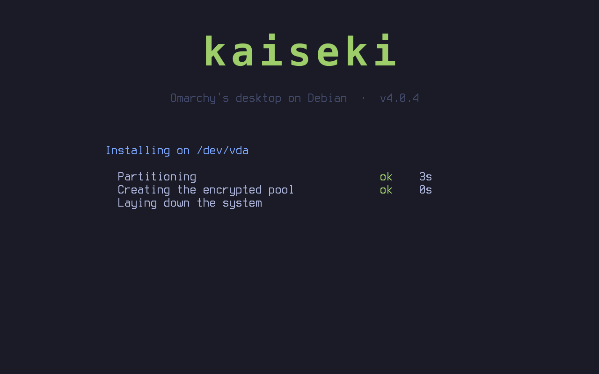
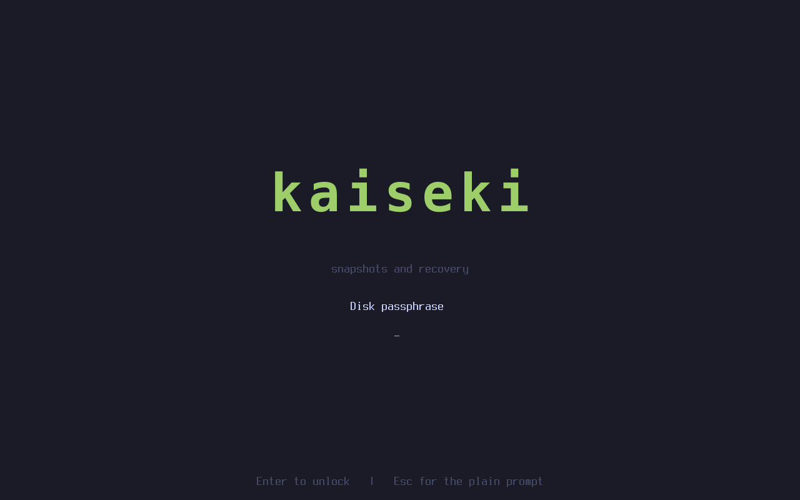
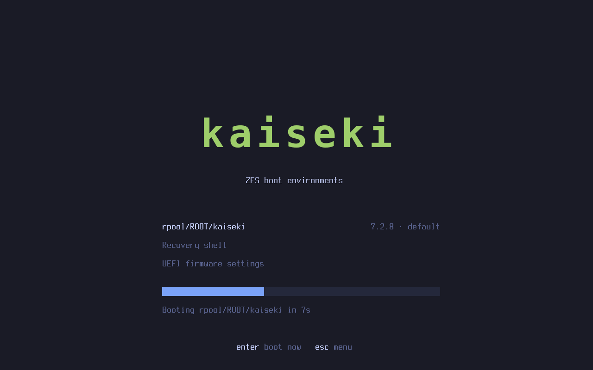
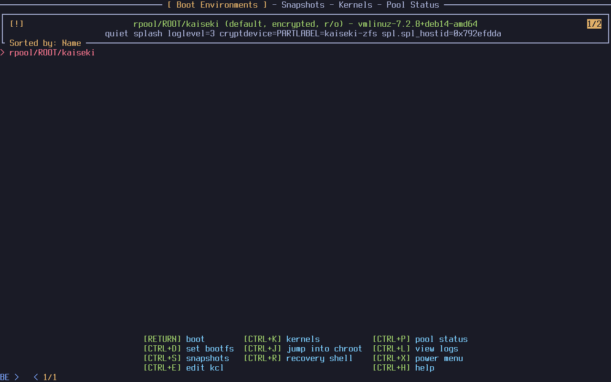
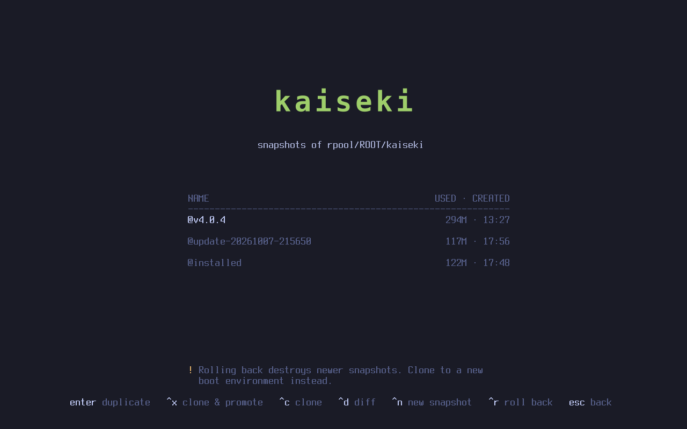

# The kaiseki installer

Boot the ISO, choose the disk, and that is the only decision before the system is running:

1. Boot the ISO.
2. Choose the disk (and confirm that it will be erased). These screens carry the same wordmark and palette as
   the boot menu: the installer sets the console palette and draws the wordmark onto the framebuffer.
3. Install, unattended: **40 seconds** in the test VM.
4. The installed system starts **without a reboot**, on the kernel that is already running.
5. Omarchy's own first-boot setup asks for keyboard, account, host name and time zone.
6. It creates the owner, moves the disk encryption to the owner's password, and opens the desktop.

Status (2026-10-08): works end to end in a virtual machine on Debian testing, `tests/run-installer` passes,
including a cold boot from the disk afterwards. On real hardware it has been installed once: a desktop PC with an
AMD Radeon RX 580 and Intel Ethernet, from a USB stick the ISO was copied to as it is. The first attempt, with the
ISO published on 2026-10-07, stopped at "System setup" (see "Hardware packages" below); the second, with the
changes described there, installed in 50 seconds (the owner's reading of the installer's own figure; 35 seconds in
the test VM with the same ISO). Nothing else about that machine has been checked yet.

| | |
|---|---|
| 0. The ISO's boot menu  | |
| 1. Choose the disk  | 2. Confirm  |
| 2b. Installing  | |
| 3. Installed system, same kernel: upstream's setup  | 4. Keyboard  |
| 5. Account, host name, time zone  | 6. Setting up  |
| 7. Desktop  | 8. Later cold boots: Omarchy's Plymouth prompt, once  |

## How it is built

| Piece | What it does |
|---|---|
| `installer/build-root.sh` | On a build machine: bootstrap Debian into a ZFS dataset, add kernel, ZFS, firmware and Omarchy's whole package set through the shim (kaiseki's own packages from the published repository, docs/UPDATE.md), fetch the hardware packages into apt's cache (below), export as a compressed ZFS stream (7.7 GB installed, 2.6 GB stream). Nothing machine-specific. |
| `installer/build-zbm.sh`, `installer/zbm/` | kaiseki's own ZFSBootMenu image with its unlock screen and colours. A generic (not host-only) dracut image. |
| `installer/build-iso.sh` | A small Debian live system (same kernel package and ZFS as the image) carrying the stream, ZFSBootMenu and the installer, which starts on tty1. 4.3 GB. |
| `installer/install.sh` | The install itself, below. |
| `shims/cryptsetup`, `shims/limine-update`, `shims/kaiseki-initramfs` | Let upstream's first-boot setup re-key a ZFS pool and rebuild a Debian initramfs while it believes it is re-keying LUKS and updating Limine. |

## What the 40 seconds are

| Step | Time | What |
|---|---|---|
| Partitioning | 4 s | GPT: 1 GB EFI system partition, the rest one ZFS partition. |
| Encrypted pool | <1 s | `rpool`, AES-256-GCM, with a random throwaway passphrase. |
| Laying down the system | 26 s | `zfs receive` of the prepared root into `rpool/ROOT/kaiseki`; `rpool/home`. |
| Making it this machine | <1 s | Machine id, ssh host keys, fstab for the ESP. The host id is the same on every kaiseki pool (`00bab10c`, ZFSBootMenu's convention). |
| System setup | 7 s | Upstream's `omarchy-apply-system --defer-provisioning --first-install` in the target, so its hardware fixes see the real machine. |
| Arming first boot | <1 s | Upstream's `omarchy-provision-owner.service` and its `pending` flag, as its own ISO does. |
| Boot loader | 2 s | systemd-boot, kernel and the image's own initramfs on the ESP; ZFSBootMenu as a second entry. The initramfs is rebuilt (15 s) only if this machine's setup changed something that goes into it. |
| Verifying | 1 s | Loader entry, kernel and initramfs on the ESP (ZFS and Plymouth inside, no key), `bootfs`, passphrase; snapshot `@installed`. |

The initramfs used to be built three times: here, and twice more during first-boot setup, where upstream calls
`limine-update` after setting the password and for its boot menu. On Omarchy the boot image carries the throwaway
disk key and must be rebuilt without it; kaiseki's never does. `shims/kaiseki-initramfs` fingerprints what goes
into the initramfs (initramfs-tools configuration, host id, keyboard, modprobe settings, Plymouth, ZFS key
loading), records the fingerprint after every build, and rebuilds only when it differs: a non-US keyboard chosen
at setup, or a hardware fix that adds a driver setting. The image is built so that a plain install matches it.
`KAISEKI_TRACE=1 tests/run-installer NAME` records every process of a run with the kernel's own tracepoints, and
`tests/trace-report` reads it; `tests/run-installer` fails if an initramfs build happens on a standard VM.
Measured in the VM: install 66 s to 40 s, and from confirming the setup form to the login manager 56 s to 12 s.

## Hardware packages

Upstream's system setup installs packages when it finds the hardware for them: a Vulkan driver for an Intel or
AMD graphics card, Intel video acceleration, `thermald` on an Intel laptop. Its own ISO carries them in an offline
mirror; `install/omarchy-other.packages` is that list. A virtual machine has none of that hardware, so every
test passed while the image carried none of those packages. The first real machine had an AMD card: setup asked
for `mesa-vulkan-drivers`, apt tried to download it, and could not resolve the mirror's name, because the
installed system's `/etc/resolv.conf` points at a file under `/run` that nothing had written in the installer's
chroot. The install stopped at "System setup".

Three changes:

- `build-root.sh` runs the whole of `omarchy-other.packages` through the pacman shim with `-Sw` (download only).
  Whatever the package map gives a Debian package for is fetched into apt's cache with its dependencies: 28
  packages, 30 MB. None is installed until a machine calls for it, and then apt finds it without a network.
- `install.sh` writes the live system's name servers where the target's `resolv.conf` points, so a script that
  needs something the image does not carry can fetch it when there is a network. When system setup fails, the
  end of upstream's own log (`/var/log/omarchy-install.log` in the target) is shown.
- `tests/run-installer` installs as such a machine would. Two kernel arguments, for tests only:
  `kaiseki.fake-gpu=amd,intel` puts an `lspci` in front of the real one for the length of system setup, listing
  those cards as well as the machine's own; `kaiseki.offline=1` leaves the target without name servers. The test
  uses both and checks that `mesa-vulkan-drivers`, `intel-media-va-driver` and `libvpl2` are installed at the end.

Not covered: NVIDIA. Every NVIDIA package is `-skip` in the map, so such a machine is left on the kernel's own
driver. Debian's driver is in `non-free`, which the image does not use.

## No reboot

`systemctl soft-reboot`: systemd shuts the live system's userspace down and starts the installed one from
`/run/nextroot`, on the same kernel. The pool is created without an alternate root and the root dataset is
mounted with `-o zfsutil`, so the pool is already in its final shape at the hand-over. The test confirms it:
one boot in the journal, and the kernel command line is still the live ISO's.

The installed system has then never booted from its own disk, so the installer verifies what a cold boot
needs before handing over, and `tests/run-installer` powers the machine off and boots it from the disk alone.
If the live kernel ever differs from the image's, the installer falls back to `kexec` into the installed kernel.

## Encryption without an early question

The pool is encrypted from the first byte with a throwaway passphrase. First-boot setup then asks for the
owner's password and re-keys the pool to it; `zfs change-key` is instant and rewrites no data. Upstream's
setup does this for LUKS; `shims/cryptsetup` answers the same calls for ZFS.

The pool's key location is `prompt`: the passphrase is not stored anywhere on the disk. As on Omarchy, an
encrypted machine then logs the owner in automatically: the disk passphrase is the authentication.

ZFS wants at least 8 characters, and upstream's form accepts any non-empty password, so a short one used to pass
the form and fail later at the re-key step. An overlay patch makes the form ask for 8 characters up front
(`overlay/patches/zfs-password-min-length.patch`); `tests/run-installer` types a short one first to check.

## Booting the installed system

| | Normal boot | Snapshots and recovery |
|---|---|---|
| Chain | firmware -> systemd-boot (menu hidden; hold Space) -> kernel | firmware entry "kaiseki snapshots (ZFSBootMenu)" |
| Kernel and initramfs | on the EFI system partition, kept there by Debian's `systemd-boot` kernel hooks | read from inside the pool |
| Passphrase prompt | Plymouth with Omarchy's theme, once | kaiseki's unlock screen in ZFSBootMenu, then Plymouth again |

ZFSBootMenu is kaiseki's own build (`installer/build-zbm.sh`, from pinned source, with the build machine's
kernel and ZFS module) so that it can carry kaiseki's look: a console palette, an unlock screen in place of the
bare `Enter passphrase for 'rpool':` line (three tries, Esc for the plain prompt), and a splash shown by the EFI
stub. The wordmark on the unlock screen is the rendered image from the ISO's boot menu, copied onto the
framebuffer; block characters are the fallback where there is no 32-bit framebuffer. The hooks are in `installer/zbm/`.

Its two main screens, boot environments and snapshots, are redrawn the same way (`installer/zbm/kaiseki-ui.sh`
replaces ZFSBootMenu's `draw_be` and `draw_snapshots`): no borders or preview pane, one centred column under the
wordmark, kernel version and date on each row, the keys on one line at the bottom. The keys and what they do are
ZFSBootMenu's own. The default boot environment starts after a 10 second countdown (Enter starts it at once, any
other key opens the menu). The remaining screens (name prompts, kernels, pool status, help, the recovery shell)
keep ZFSBootMenu's layout in kaiseki's colours.

| | |
|---|---|
| Unlock  | Countdown  |
| Boot environments  | Snapshots  |

The first design booted through ZFSBootMenu only. Its passphrase prompt is plain text and cannot be themed,
because it runs before the system's own kernel; Omarchy's prompt is Plymouth in the initramfs, so the
passphrase is asked there now. The price is the usual one: kernel and initramfs sit unencrypted on the ESP,
as on Omarchy.

## Decisions taken, and open

- **Debian testing is the base** for the image and the repository (see README).
- **systemd-boot plus ZFSBootMenu** (built from pinned source, checksum verified), see above. The pool is created
  with `compatibility=openzfs-2.2-linux` so ZFSBootMenu's own ZFS can always read it.
- **Whole disk only.** No dual boot yet.
- **No Secure Boot.** ZFS is an out-of-tree module and ZFSBootMenu is unsigned; enrolling keys cannot be unattended.
- **Not tested:** a kernel upgrade refreshing the ESP; restoring a snapshot from ZFSBootMenu. Booting through
  the ZFSBootMenu entry (unlock screen, countdown, menu, on to the desktop) and taking a snapshot from its
  snapshots screen are tested on a machine installed from the ISO; cloning, duplicating and rolling back from
  there, and "UEFI firmware settings", are not.
- **Interrupted between install and setup:** the throwaway passphrase exists only in the installed system,
  so a power cut in that window means installing again (one minute). Upstream embeds an auto-unlock key instead.
- Updating an installed machine: see [UPDATE.md](UPDATE.md).
- Not done: the factory-reset snapshot Omarchy offers; the console font upstream uses for its logo (some
  glyphs show as `#`); the installed system's own boot screens say Omarchy, the ISO menu says kaiseki; Wi-Fi during setup (nothing in the install needs the network,
  first-boot setup fetches Node.js if it can).
- Two upstream packages are still missing from the image: `pinta` and `dotnet-runtime` (both need the .NET SDK).

## Download

`installer/publish-iso` uploads the ISO to Cloudflare R2 object storage (a 4 GB file does not belong behind the
web server), together with a SHA-256 file and a signature made with the kaiseki archive key. It is served from
`https://dl.kaiseki.este.systems/`; `latest.txt` there names the current file. The project page's download
section is filled in from the last upload when the page is deployed (from its own repository). The upload credentials live outside the
repository (`~/.config/kaiseki/r2.env`, mode 600).

The first published ISO, `kaiseki-v4.0.4-20261007.iso`, passed `tests/run-installer` before upload; afterwards
the full download's SHA-256 was compared with the local file and the signature checked with `gpgv`.

## Building and testing

```
# on the host, once: publish the build machine's packages (tests/run leaves such a machine behind)
packages/publish NAME

# on that Debian testing build machine
installer/build-root.sh        # -> /srv/kaiseki/image/root.zfs.zst, manifest      (about 27 minutes)
installer/build-iso.sh         # -> /srv/kaiseki/image/kaiseki-TAG.iso             (about 11 minutes)

# on the host, with the ISO, its kernel and initrd in .cache/iso/
tests/run-installer NAME       # empty VM: install, first-boot form by key presses, cold boot; PASS or FAIL
tests/run-update NAME          # then Omarchy's own update on that machine
installer/try NAME             # or try it by hand
vm/vm view NAME                # watch it
```

Unattended installs for tests: the kernel arguments `kaiseki.disk=/dev/vda` (answers the one question),
`kaiseki.enter=soft-reboot|kexec|reboot|none`, and `kaiseki.fake-gpu=amd,intel` and `kaiseki.offline=1`
("Hardware packages" above). `KAISEKI_INSTALL_ARGS="kaiseki.fake-gpu=amd,intel" tests/run-installer NAME` runs the
test with name servers; `KAISEKI_INSTALL_ARGS= ` runs it as a plain virtual machine.
