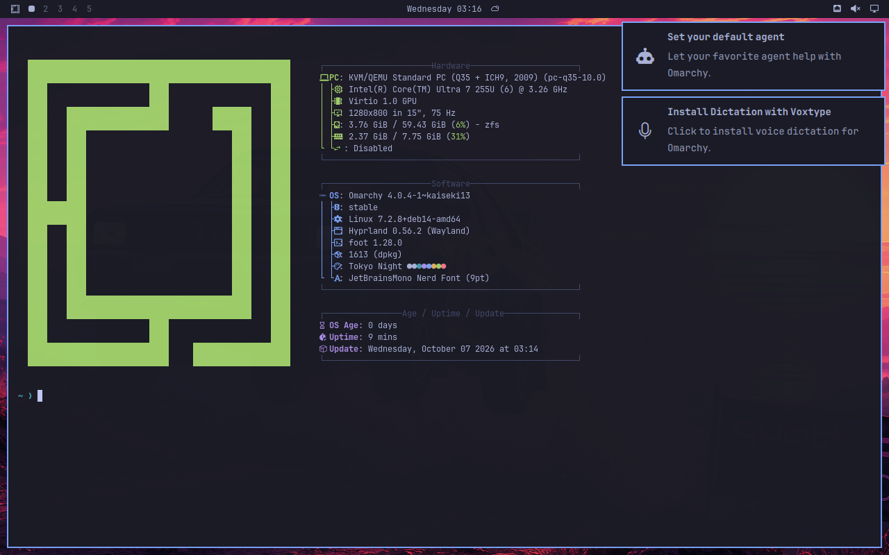
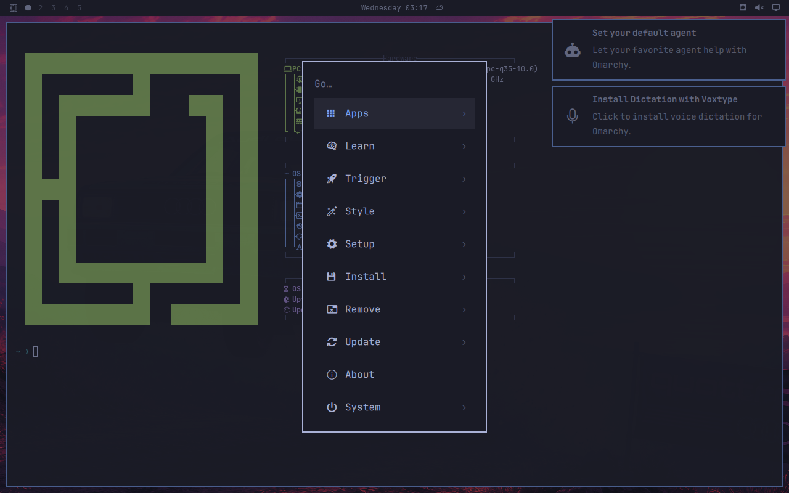
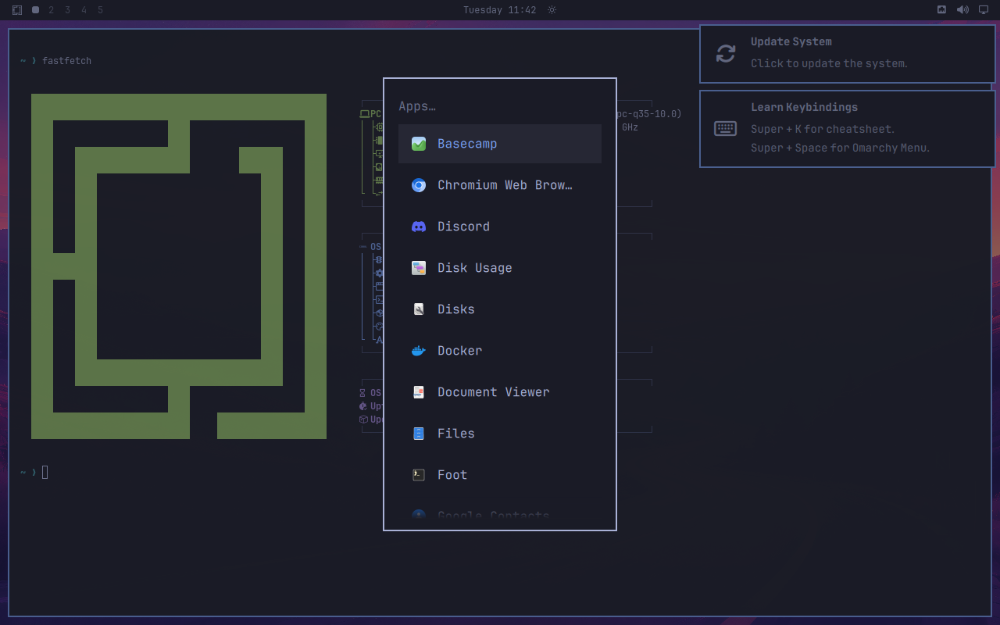
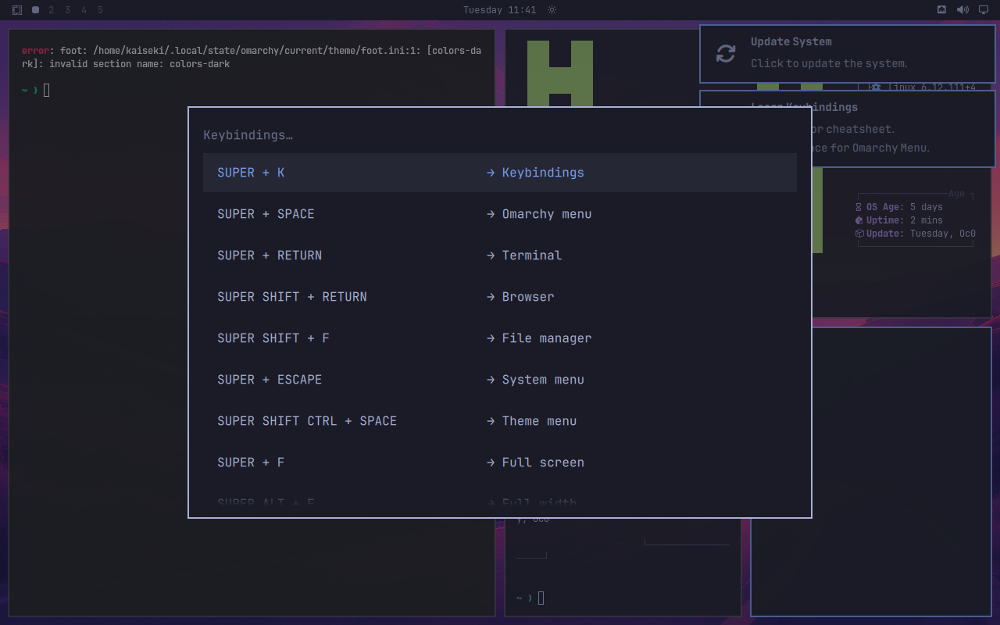
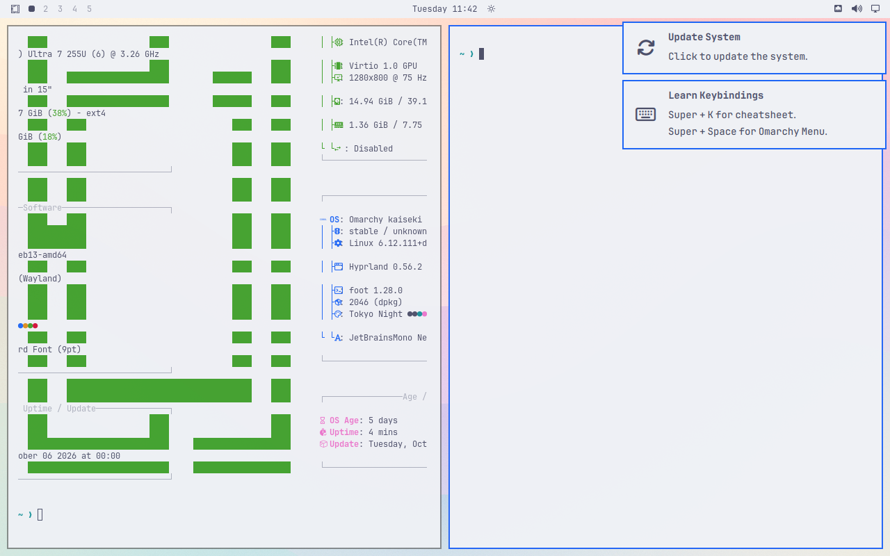
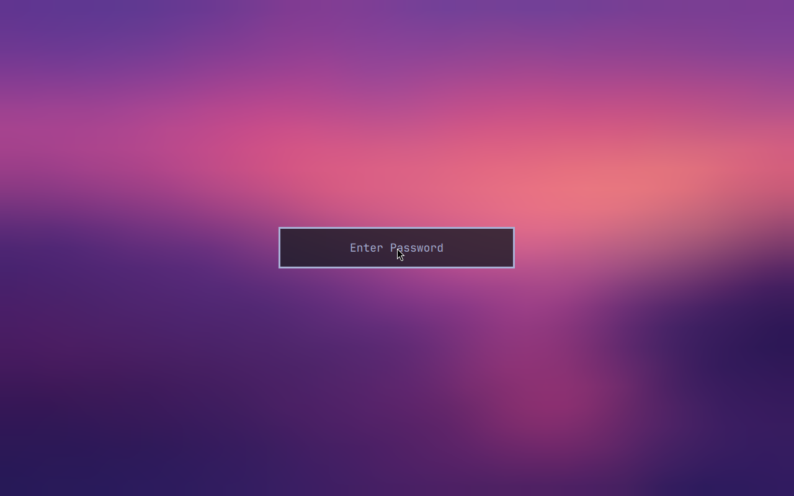

# The port: Omarchy v4.0.4 installed on Debian 13 by its own scripts

Run on 2026-10-06 in a test VM. Follows [TRIAL.md](TRIAL.md), which only proved that the compositor and
the shell start. Here Omarchy's whole install pipeline runs, unmodified, and the result is the real desktop.

## Reproduced from nothing

`tests/run fresh`, 2026-10-06: new Debian 13 VM to checked desktop in 31 minutes, unattended. 17 minutes
of that is rebuilding six source packages (Hyprland alone 11), 9 installing upstream's package list,
10 seconds upstream's system and user setup. All 14 checks in `tests/check.sh` pass after the reboot.

The first two attempts failed, each on something the hand-built VM had hidden: the `omarchy-settings` recipe
needs ImageMagick at build time (the builder now installs a recipe's makedepends), and the packaged CUPS
override names Arch's ids (now left out, `overlay/omit.txt`).

## What runs unmodified

| Upstream piece | Result on Debian 13 |
|---|---|
| The package recipes `omarchy`, `omarchy-settings`, `mise-bin`, `ufw-docker`, `ttf-jetbrains-mono-nerd-basic` (PKGBUILDs from `omarchy-pkgs`) | Built with Debian's own `makepkg` and wrapped as `.deb` by `packages/pkgbuild2deb`. No file conflicts with Debian packages. |
| `install/omarchy-base.packages` (147 names) | Installed through the `pacman` shim and `map/arch-to-debian.tsv`. |
| `omarchy-apply-system`: 49 scripts (config, login, post-install, hardware) | All 49 pass. |
| `omarchy-provision-user` (theme, browser, git, mise, keyring ...) | Completes: "User finalization complete." |
| Login: SDDM with Omarchy's theme, autologin into the `omarchy` uwsm session | Works. |

## Walkthrough

| | |
|---|---|
| Omarchy menu (Super+Space)  | App launcher  |
| Keybindings (Super+K), 224 entries  | Live theme switch to Catppuccin Latte  |
| Lock screen: wrong password refused, right one unlocks  | |

Driven with real key presses through the VM (`vm/vm key`, `vm/vm type`), not by calling the scripts behind them.

## What kaiseki had to add

Everything is in the repository; nothing was done by hand in the VM that `tests/install.sh` does not do.

1. **`packages/pkgbuild2deb`**: upstream's packaging is a second repository of Arch recipes. The recipe's
   `package()` runs as is; `depends=` goes through the map, `backup=` becomes conffiles, the `.install`
   scriptlet becomes the postinst.
2. **`overlay/keep-debian.txt`**: three files upstream's scriptlet overwrites and Debian must keep:
   `/etc/os-release`, `/etc/nsswitch.conf`, `/etc/cups/cups-files.conf`. **`overlay/omit.txt`**: one
   Arch-only file left out of the package.
3. **`compat/`**: Arch's PAM stack names forwarding to Debian's, a no-op `linux-modules-cleanup.service`,
   `/etc/pacman.d`. See [compat/README.md](../compat/README.md).
4. **`packages/extra.txt`**: `gawk` (Omarchy uses gawk syntax; Debian's awk is mawk), `systemd-oomd`,
   `systemd-resolved`, `pkexec` (inside bigger packages on Arch).
5. **Rebuilt `foot` 1.28** from unstable: Debian 13's 1.21 rejects Omarchy's theme file (`packages/rebuild.txt`).
6. **Map fix**: Arch's `docker` is Debian's `docker.io` plus `docker-cli`.
7. **One more overlay patch** (two in total): fastfetch runs a bash-only `echo -e` through `/bin/sh`, which
   is dash on Debian.

## Differences that remain

- **23 upstream packages are not built yet** (logged by the shim, reported as installed so scripts carry on):
  aether, asdcontrol, cliamp, dotnet-runtime, dua-cli, gpu-screen-recorder, herdr,
  hyprland-preview-share-picker, lazydocker, localsend, moonlight-qt, obsidian, omacalc, omacut, omarchy-nvim,
  omawrite, pinta, tensaku, tobi-try, ttf-ia-writer, ttfx, tzupdate, usage. 18 of them have a recipe in
  `omarchy-pkgs`; the ones compiled from source need their build dependencies mapped first.
- **Updating is not ported.** The bar offers "Update System"; upstream's update path drives pacman,
  snapshots and migrations. kaiseki needs its own: fetch tag, rebuild packages, stage, check, switch.
- **No login lockout.** Arch's `system-auth` uses `pam_faillock` and Omarchy raises its limit to 10.
  Debian's login stack has no lockout. The lock screen has its own limit and that works.
- **`/bin/sh` is dash.** Found one bash-only snippet so far; there may be more in parts not exercised.
- **Boot stack untouched on purpose:** limine, snapper, mkinitcpio, plymouth are no-ops. Debian keeps
  GRUB or ZFSBootMenu and its own initramfs. Snapshots before updates will come from ZFS (INSTALLER.md).
- The test user is made by cloud-init and re-seeded from `/etc/skel`; the installer will create the owner
  through upstream's `omarchy-provision-owner` instead, which is not exercised yet.
- Not opened yet: control panels (Wi-Fi, Bluetooth, audio, displays), screenshots and recording, the
  browser and web apps, printing, sleep and idle.

## Test harness lessons

Upstream's install is right to do both of these on a desktop, and both cut a cloud-image VM off:
it retires systemd-networkd for NetworkManager, and it enables a default-deny firewall.
`tests/keep-reachable.sh` hands the link to NetworkManager and keeps ssh open; `vm/vm` now writes a serial
log and can type on the console (`vm/vm type`).
