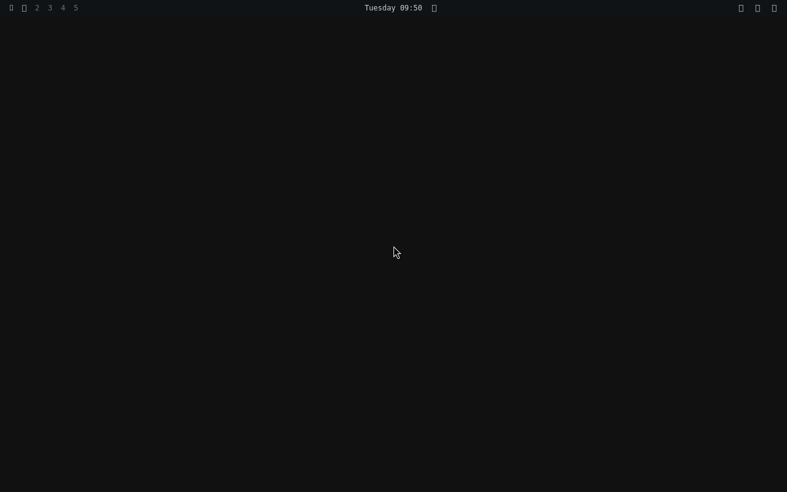

# Feasibility trial: Omarchy v4.0.4 on Debian 13

Run on 2026-10-06 in the `spike` test VM (fresh Debian 13 cloud image, virtio-gpu). Result: **feasible**.
Omarchy's Hyprland configuration and its Quickshell shell run on Debian 13.

## What it took

1. **Rebuilt from Debian unstable** with `packages/build.sh` (about 16 minutes on 6 cores):
   `wayland 1.26.0`, `wayland-protocols 1.49`, `lua5.5 5.5.1`, `libinput 1.31.3`, `hyprland 0.56.2`.
   Everything else Hyprland needs comes from trixie-backports (23 packages, chosen by apt on its own).
2. **One source patch** for Hyprland: `std::string + std::string_view` is C++26 and needs GCC 15; Debian 13
   has GCC 14. One line, in one of 380 compiled files (`packages/patches/hyprland/`).
3. **One overlay patch** for Omarchy's shell: Qt 6.8 treats `transient` as a reserved word in QML
   JavaScript (Arch ships Qt 6.11). One variable renamed (`overlay/patches/`).
4. Quickshell 0.3.0 from trixie-backports, unchanged.

## Verified

- `Hyprland --verify-config` on Omarchy's unmodified Lua configuration: `config ok`.
- Session starts; `omarchy-launch-shell` runs the shell; Hyprland reports the layers `omarchy-bar` and
  `omarchy-background`; the bar shows workspaces and the clock.
- After installing the QML modules and services Omarchy expects, the shell log has no load failures left.

## Not done yet (the picture shows it)

- No theme applied (no wallpaper, default colours): `install/user/theme.sh` has not run.
- Icon glyphs are boxes: the Nerd Font is not installed.
- None of Omarchy's install pipeline has run; no `pacman` shim exists; menus, launcher, lock screen,
  notifications, control panels are untested. A terminal did not open on `exec foot`.
- Remaining log noise: "Cannot create a component in an invalid context" (6), one binding loop in the bar.
- The rebuilt `wayland` and `libinput` replace Debian's system-wide; effects on other software untested.
- Qt 6.8 versus 6.11 is the standing risk: more QML that needs the newer Qt may appear in parts of the
  shell that have not been opened yet, and in future releases.
